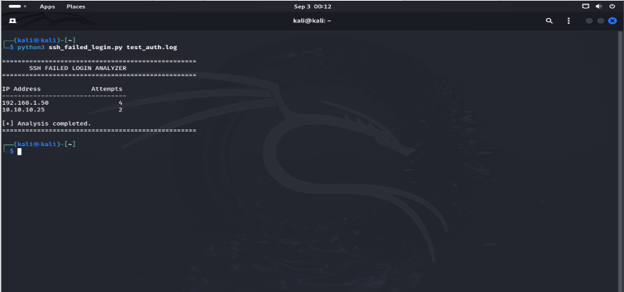

## SSH Failed Login IP Analyzer


## Project Overview

The SSH Failed Login IP Analyzer is a Python-based cybersecurity tool designed to automate the analysis of Linux SSH authentication logs.

Instead of manually searching through large authentication log files, the tool automatically identifies failed SSH login attempts, extracts the source IP addresses, and counts the number of failed attempts associated with each IP.

This project simulates a basic SOC Analyst log-analysis and detection workflow.

---

## Project Objectives

The main objectives of this project are:

* Automate SSH authentication log analysis.
* Detect failed SSH login attempts.
* Extract source IP addresses from authentication logs.
* Count failed login attempts by source IP.
* Reduce manual log-analysis time.
* Identify IP addresses generating repeated authentication failures.
* Build practical Python skills for SOC automation.

---

## Features

* Reads Linux SSH authentication logs.
* Detects failed SSH password attempts.
* Extracts source IP addresses using regular expressions.
* Counts failed login attempts per IP address.
* Displays IP addresses according to the number of failed attempts.
* Handles missing log files.
* Handles permission errors.
* Supports custom log files for testing.
* Uses only Python standard libraries.
* Designed for SOC and Blue Team learning.

---

## Project Architecture

```text
Linux SSH Authentication Logs
            │
            ▼
       Log File Reader
            │
            ▼
    Detect Failed Password
            │
            ▼
     Extract Source IP
            │
            ▼
    Count Attempts per IP
            │
            ▼
      SOC Analysis Output
````

---

## Technologies Used

* Python 3
* Linux
* Kali Linux
* Regular Expressions (`re`)
* Python `collections`
* Python `sys`
* SSH Authentication Logs

---

## Project Structure

```text
ssh-failed-login-analyzer/
│
├── README.md
├── requirements.txt
├── .gitignore
├── src/
|    └── ssh_failed_login.py
│
├── test_auth.log
│
└── screenshots/
    └── terminal_output.png
```

---

## Requirements

* Python 3.8 or higher
* Linux operating system
* Kali Linux recommended for the lab environment
* SSH authentication logs

No external Python packages are required.

The project uses Python's built-in libraries:

```text
re
collections
sys
```

---

## Installation

### 1. Clone the Repository

```bash
git clone https://github.com/hassankhan-34/ssh-failed-login-analyzer.git
```

### 2. Navigate to the Project Directory

```bash
cd ssh-failed-login-analyzer
```

### 3. Verify Python Installation

```bash
python3 --version
```

Example:

```text
Python 3.12.x
```

No additional Python packages are required.

---

## Usage

### Analyze a Test Log

Run the analyzer against the included test log:

```bash
python3 ssh_failed_login.py test_auth.log
```

### Analyze the Linux Authentication Log

On Linux systems using `/var/log/auth.log`:

```bash
sudo python3 ssh_failed_login.py /var/log/auth.log
```

The application will:

1. Read the authentication log.
2. Search for failed SSH password attempts.
3. Extract the source IP address.
4. Count failed attempts for each IP.
5. Display the results.

---

## Example Input

Example authentication log:

```text
Sep 3 08:01:10 kali sshd[1001]: Failed password for root from 192.168.1.50 port 50122 ssh2
Sep 3 08:01:15 kali sshd[1002]: Failed password for root from 192.168.1.50 port 50123 ssh2
Sep 3 08:01:20 kali sshd[1003]: Failed password for admin from 10.10.10.25 port 44111 ssh2
Sep 3 08:01:25 kali sshd[1004]: Accepted password for hassan from 192.168.1.10 port 33001 ssh2
Sep 3 08:01:30 kali sshd[1005]: Failed password for root from 192.168.1.50 port 50124 ssh2
Sep 3 08:01:35 kali sshd[1006]: Failed password for admin from 10.10.10.25 port 44112 ssh2
Sep 3 08:01:40 kali sshd[1007]: Failed password for root from 192.168.1.50 port 50125 ssh2
```

The successful login from `192.168.1.10` is ignored because the analyzer focuses only on failed SSH authentication attempts.

---

## Example Output

```text
==================================================
       SSH FAILED LOGIN ANALYZER
==================================================

IP Address              Attempts
--------------------------------
192.168.1.50                   4
10.10.10.25                    2

[+] Analysis completed.
==================================================
```

---

## SOC Use Case

In a real SOC environment, repeated failed SSH authentication attempts can be an indicator of suspicious activity.

For example:

```text
192.168.1.50  → 20 failed attempts
10.10.10.25  → 7 failed attempts
172.16.1.40  → 2 failed attempts
```

An IP generating a large number of authentication failures may require further investigation.

A SOC analyst could investigate:

* Source IP address
* Target username
* Authentication timestamps
* Successful logins following failed attempts
* Firewall events
* Network activity
* Threat intelligence information
* Other authentication events

---

## Detection Logic

The analyzer searches for the following SSH authentication event:

```text
Failed password
```

It then extracts the IP address following:

```text
from <IP_ADDRESS>
```

The extracted IP address is stored and counted.

Conceptually:

```text
Failed SSH Event
       │
       ▼
Extract IP Address
       │
       ▼
Counter()
       │
       ▼
Number of Failed Attempts
```

---

## Error Handling

The script handles common problems such as:

### Log File Not Found

```text
[!] Log file not found
```

### Permission Denied

```text
[!] Permission denied
[!] Try running the script with sudo.
```

This allows the tool to fail gracefully instead of crashing unexpectedly.

---

## Security Considerations

This project is designed for defensive cybersecurity and SOC training.

Do not upload real authentication logs to a public GitHub repository.

Real logs may contain sensitive information such as:

* Internal IP addresses
* Usernames
* Hostnames
* Authentication activity
* System information

Use synthetic or sanitized logs when publishing the project publicly.

---

## Skills Demonstrated

This project demonstrates practical SOC Analyst skills including:

* Linux log analysis
* SSH security monitoring
* Python programming
* Regular expressions
* IP address extraction
* Security event detection
* Event counting
* Basic security automation
* Defensive security analysis
* Command-line Python usage

---

## Learning Outcome

After completing this project, I can:

* Understand Linux SSH authentication logs.
* Identify failed SSH authentication events.
* Extract source IP addresses using Python.
* Count security events by IP address.
* Automate repetitive SOC log-analysis tasks.
* Build basic defensive security automation tools.

---

## Future Improvements

Future versions of this project may include:

* Suspicious IP threshold detection.
* Username extraction.
* Timestamp extraction.
* Port extraction.
* CSV report generation.
* JSON report generation.
* Severity classification.
* SOC-style alert generation.
* IP reputation checking.
* VirusTotal integration.
* AbuseIPDB integration.
* Graphical reporting.
* SIEM integration.
* Email notifications.

---

## Screenshots

### Terminal Output



---

## Disclaimer

This project is created for educational, defensive cybersecurity, SOC Analyst training, and authorized security monitoring purposes only.

Only analyze logs, systems, networks, and security data that you own or have explicit permission to monitor.

---

## Author

**Hassan Khan**

BSIT Student | Cybersecurity Enthusiast | Future SOC Analyst

---

## Support

If you found this project useful, consider giving the repository a star.

```

**One correction from our previous `.gitignore`:** because we want to upload the safe `test_auth.log`, we'll adjust `.gitignore` before the GitHub upload so that **real logs stay protected but our synthetic test file can be committed**.
```
